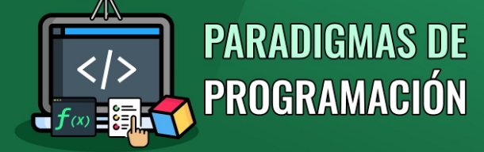

# PRIMER TRABAJO PRACTICO

## Grupo: Las fuerzas del cielo

### Integrantes
* Lopez Becerra, Analía DNI 35270596
* Llanos, Ariel DNI 43038404
* Echaniz, Agustin Alejo DNI 41688118
* Lamas, Martin Alejandro DNI 30492150
* Mantello, Martin Eduardo DNI 44172630

## Consigna

### Gustos
* Se nos pide armar un programa que ayude a entender qué cosas le gustan a distintas personas.

### Objetos y personas
Tener en cuenta a estas personas:

* Rosa: le gustan las cosas que pesan 2 kilos (o sea 2000 gramos) o menos.
* Estefanía: le gustan las cosas de colores fuertes.
* Luisa: le gustan las cosas que sean de un material que brilla.
* Juan: le gustan las cosas que, o bien son de un color que no es fuerte, o bien pesan entre 1200 y 1800 gramos.
* Como colores contemplar (al menos) rojo, verde, celeste y pardo. De estos, los dos primeros son fuertes, los otros no.

### Como materiales tenemos: 
* el cobre y el vidrio que brillan; el lino, la madera y el cuero que no.

Finalmente, considerar (al menos) estos objetos:

* una remera roja de lino, pesa 800 gramos.
* una pelota parda de cuero, pesa 1300 gramos.
* una biblioteca verde de madera, pesa 8000 gramos.
* un muñeco celeste de vidrio, de peso variable.
* una placa de cobre, de peso y color variables.
* Bolichito: Agregar al modelo un bolichito, que vende dos objetos: uno está en la vidriera, otro está en el mostrador. Estos objetos van cambiando con el tiempo.

Se esperar que el objeto que representa al bolichito responda a estos mensajes:

* esBrillante(): indica si los dos objetos que tiene (el de mostrador y el de vidriera) son de un material que brilla.

* esMonocromatico(): indica si los dos objetos que tiene son del mismo color.
Esto se daría si tiene p.ej. la remera en mostrador y la placa en vidriera, y la placa se configura como de color rojo y peso 2400 gramos.

* estaDesequilibrado(): indica si el objeto en el mostrador pesa más que el de la vidriera.
P.ej. si el bolichito tiene la biblioteca en el mostrador y la remera en la vidriera, está desequilibrado.

* tieneAlgoDeColor(color): indica si alguno de los dos objetos que tiene el boliche es del color indicado.
P.ej. si el bolichito tiene la biblioteca en la vidriera y la remera en el mostrador, entonces tiene algo de color rojo y tiene algo de color verde, pero no tiene nada de color pardo.

* puedeMejorar(): indica si el bolichito puede mejorar en uno de los siguientes aspectos: o bien está desequilibrado (falta de equilibrio), o bien es monocromático (falta de alegría).

* puedeOfrecerleAlgoA(persona): indica si alguno de los dos objetos que tiene en venta el boliche le gustan a la persona.
P.ej. si el bolichito tiene la remera en la vidriera y la pelota en el mostrador, entonces puede ofrecerle algo a Estefanía (la remera) y a Juan (la pelota) pero no a Luisa (porque no le gustan ni la remera ni la pelota).

### Más cosas
Agregar al modelo estos objetos:

* un arito celeste de cobre, que pesa 180 gramos.
* un banquito de madera que pesa 1700 gramos. Al principio es naranja, pero puede cambiar de color. El naranja es un color fuerte.
* una cajita roja de cobre, que tiene un objeto adentro. Este objeto puede ser cualquiera de los definidos previamente, y puede cambiar. El peso de la cajita es de 400 gramos más el peso de lo que tiene adentro.
